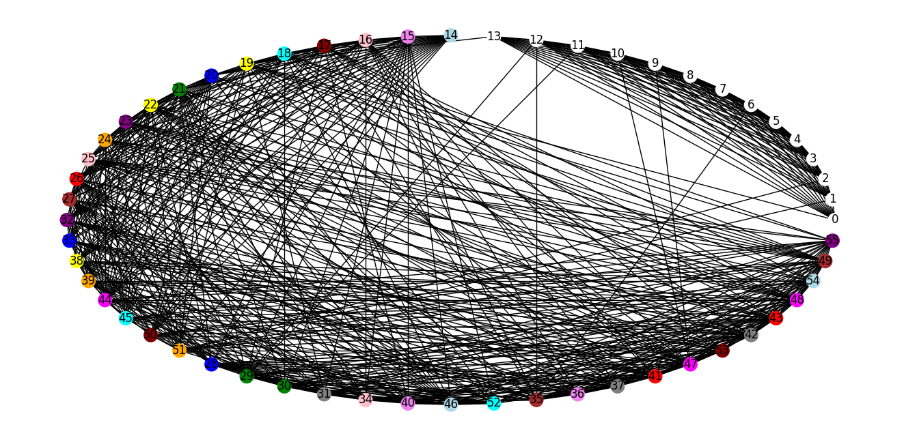

<h1 align="center">Coloração de Grafos - Projeto 3</h1>


---


<h2>💻 Autores</h2>

<table>
  <tr>
    <td align="center"><a href="https://github.com/isasisnando" target="_blank"><br /><sub><b>Isa Souza</b></sub></a><br /></td>
    <td align="center"><a href="https://github.com/lucasdbr05" target="_blank"><br /><sub><b>Lucas Lima - 231003406</b></sub></a><br /></td>
</table>

# Setup
Para instalar as dependencias que utilizamos no projeto, é necessário ter o compilador python instalado e o gerenciador de pacotes `pip` que utilizamos para instalar as bibliotecas que nos auxiliaram neste trabalho
```sheel
pip install matplotlib networkx
```
# Run
Executar o seguinte comando no terminal:
```sheel
py main.py
```
ou 
```sheel
python main.py
```


<h2>💬 Sobre o projeto</h2>

<p>
    O projeto consiste em montar um sequência de 14 rodadas de jogos de futebol (com dois turnos com mandos diferentes) em um campeonato onde 7 times competem. Além disso, sabe-se que um time só joga uma partida por rodada e são dadas algumas restrições adicionais descritas abaixo:
    
    Para resolver o problema, o campeonato será modelado como um grafo e a sequência será definida com base em um algoritmo de coloração em grafos.
</p>

---
<h2>Solução</h2>

<p>
   O campeonato foi modelado em um grafo, onde os vértices representam as rodadas e as partidas , e as arestas representam uma proibição, ou seja, os dois eventos indicados pelos vértices conectados por uma aresta não podem ocorrer simultaneamente. Assim, adicionaremos as seguintes arestas:
</p>
<ul>
    <li>
        Entre todas as rodadas, pois uma rodada não pode ocorrer juntamente com outra.
    </li>
    <li>
        Entre duas partidas que compartilham algum time em comum, pois cada time participa de uma partida por vez.
    </li>
    <li>
    Entre os vértices que representam as restrições dadas no enunciado do problema, por exemplo adiciona-se uma aresta entre as rodadas 1 e 14 e o jogo (DFC,CFC).
    </li>
</ul>
<p>
    A partir do grafo modelado, iremos realizar uma coloração, onde cada cor representará uma rodada. Dois vértices conectados por uma aresta não ocorrem numa mesma rodada. Para realizar essa coloração foi utilizado um algoritmo recursivo com backtracking, descrito abaixo: 
</p>

### Colaração
<p>
    Tendo o grafo modelado e montado, para realizar a coloração, utilizamos um algoritmo de coloração por meio de backtracking. Nesse algoritmo, inicializamos por um nó qualquer (por conveniência, o de menor índice), e vamos seguindo o seguinte processo: 
</p>

<ul>
    <li>
        Ao chegar em um vértice de id =  x, iteramos por todas as c cores disponíveis:
        <ul>
            <li> Se nenhum adjacente a x possui a cor c, realizamos o mesmo passo recursivamente para o vértice de id x+1, e definimos temporariamente que sua cor será c;
            </li>
            <li>
                Caso o retorno dessa recursão seja verdadeiro, mantemos a cor que escolhemos e retorna-se verdadeiro;
            </li>
            <li>
                Caso contrário, retira-se a cor c de x e permite que ele seja pintado de outra cor;
            </li>
        </ul>
    </li>
    <li>
        A base dessa recursão é se o id for igual ao número de vértices do grafo, retornando verdadeiro caso isso ocorra
    </li>
</ul>

<p>O algoritmo possui complexidade igual a O(m^v), sendo:</p>
<ul>
    <li>m: número de cores disponíveis - no caso do problema, cada rodada representa uma cor, então temos 14 cores</li>
    <li>v: número de vértices do grafo </li>
</ul>

# Resultados
Modelando o grafo como explicado acima, obtivemos o seguinte modelo:


Após rodar o algoritmo de coloração, utilizando as expecificações da explicação também feita acima, chegamos às seguintes rodadas para o torneio:

```shell
Round 1   -----    Color: red
Águias x Dragões                                     | Game ID: 26
Orcas x Leões                                       | Game ID: 47
Crocodilos x Tubarões                                    | Game ID: 51

Round 2   -----    Color: blue
Tubarões x Dragões                                     | Game ID: 20
Águias x Falcões                                     | Game ID: 29
Leões x Orcas                                       | Game ID: 36

Round 3   -----    Color: green
Tubarões x Águias                                      | Game ID: 21
Leões x Crocodilos                                  | Game ID: 37
Falcões x Dragões                                     | Game ID: 38

Round 4   -----    Color: yellow
Dragões x Crocodilos                                  | Game ID: 19
Tubarões x Leões                                       | Game ID: 22
Águias x Orcas                                       | Game ID: 30

Round 5   -----    Color: purple
Tubarões x Falcões                                     | Game ID: 23
Águias x Leões                                       | Game ID: 28
Crocodilos x Orcas                                       | Game ID: 55

Round 6   -----    Color: orange
Tubarões x Orcas                                       | Game ID: 24
Águias x Crocodilos                                  | Game ID: 31
Leões x Falcões                                     | Game ID: 35

Round 7   -----    Color: pink
Dragões x Leões                                       | Game ID: 16
Tubarões x Crocodilos                                  | Game ID: 25
Falcões x Águias                                      | Game ID: 40

Round 8   -----    Color: brown
Águias x Tubarões                                    | Game ID: 27
Orcas x Dragões                                     | Game ID: 44
Crocodilos x Falcões                                     | Game ID: 54

Round 9   -----    Color: gray
Falcões x Tubarões                                    | Game ID: 39
Orcas x Águias                                      | Game ID: 46
Crocodilos x Dragões                                     | Game ID: 50

Round 10   -----    Color: violet
Dragões x Águias                                      | Game ID: 15
Falcões x Leões                                       | Game ID: 41
Orcas x Tubarões                                    | Game ID: 45

Round 11   -----    Color: lightblue
Dragões x Tubarões                                    | Game ID: 14
Falcões x Orcas                                       | Game ID: 42
Crocodilos x Leões                                       | Game ID: 53

Round 12   -----    Color: cyan
Dragões x Orcas                                       | Game ID: 18
Leões x Tubarões                                    | Game ID: 33
Falcões x Crocodilos                                  | Game ID: 43

Round 13   -----    Color: magenta
Leões x Dragões                                     | Game ID: 32
Orcas x Falcões                                     | Game ID: 48
Crocodilos x Águias                                      | Game ID: 52

Round 14   -----    Color: maroon
Dragões x Falcões                                     | Game ID: 17
Leões x Águias                                      | Game ID: 34
Orcas x Crocodilos                                  | Game ID: 49

```



